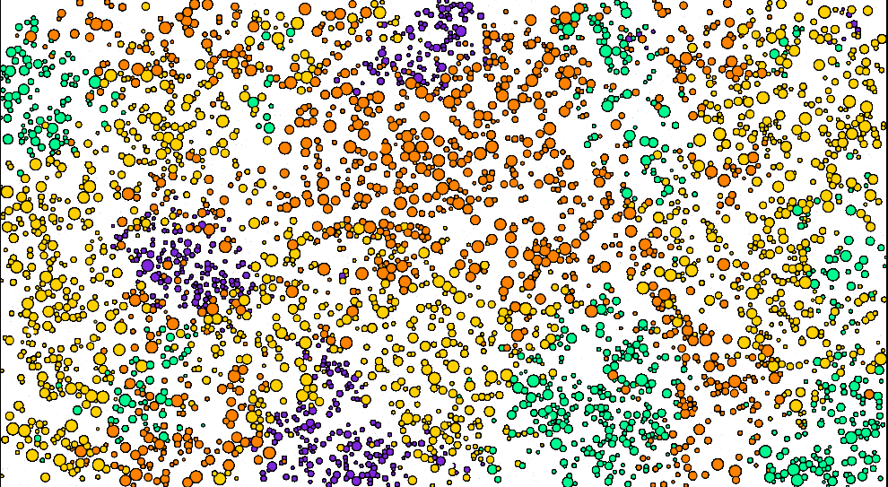
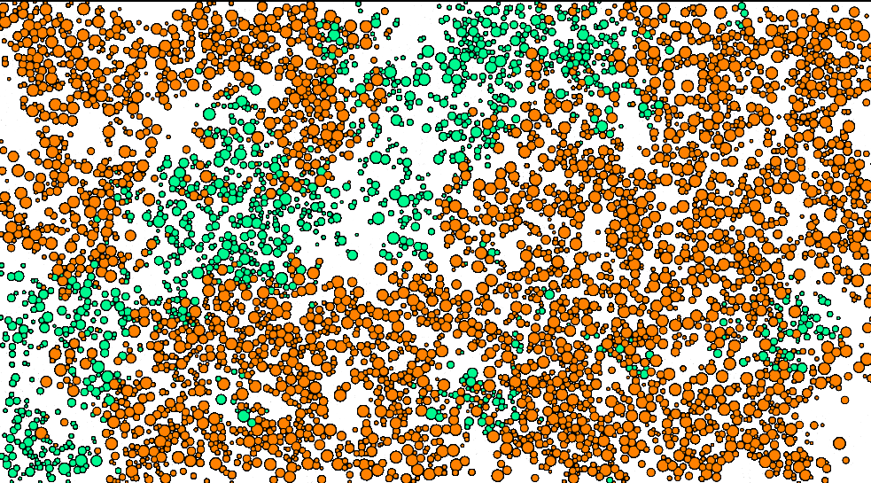
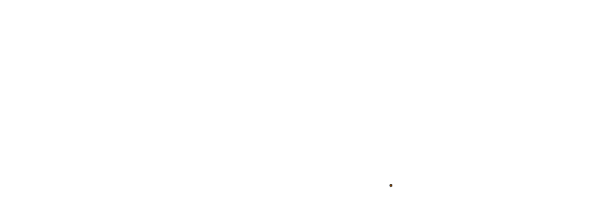
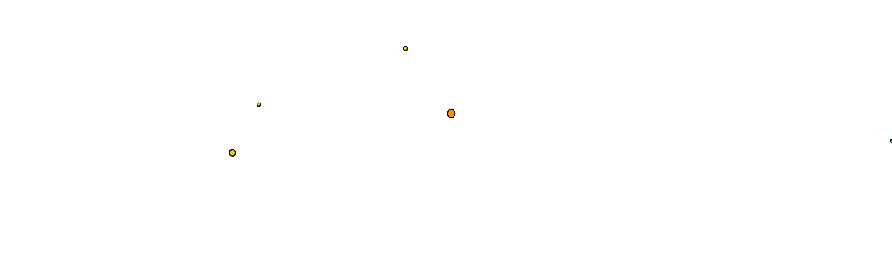
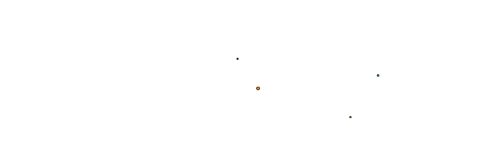
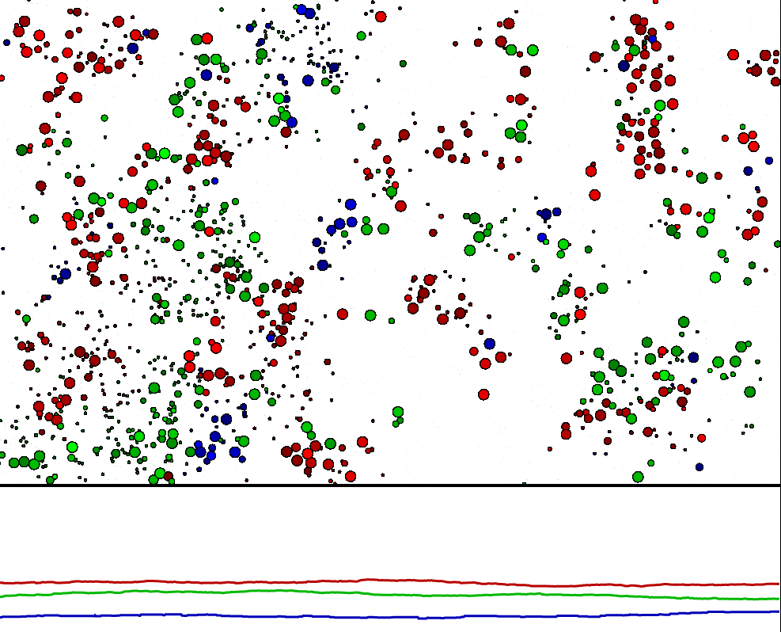

# reforestation

>A simulation of tree growth in a forest. [Try it here.](http://zebengberg.github.io/reforestation)


## Motivation

After a forest has been destroyed, new trees begin to grow and compete for space. Initially, fast-growth trees overpower the landscape. These trees rapidly accumulate territory but are not as hearty as their slow-growth counterparts. Slower-growth trees take longer to establish a footprint in the forest but they persist longer. Over time, we expect a forest to transform from the fast-growth trees that initially emerge to the old-growth trees that dominate undisturbed terrain.


## Simulation

This simulation demonstrates several distinct species of trees growing in a forest. An individual tree is displayed as a colored disk. Different species are distinguished by color. Each has its own growth-rate and expected lifespan. As in nature, these two quantities vary in opposition to one another: the faster a tree grows, the shorter its expected lifespan.

At each time step, this model is governed by the following rules.
- With small probability, a seed of a random tree species is released onto the forest floor.
- With a small probability proportional to its area, a tree will drop a seed onto the forest floor in a neighboring position. If there is no tree currently occupying that space, a new tree is born of the same species as the parent tree.
- Each tree has a growth-rate parameter that determines how the disk representing the tree increases.
- No tree is allowed to grow into another existing tree; trees should not overlap. Trees cannot grow beyond a certain constant maximal radius. Once a tree runs into a barrier (another tree, the forest edge, the maximal radius), it [stops growing](#stopping-growth) for the remainder of its life.
- The probability that a tree dies depends on its growth-rate and age. After a tree dies, it is be removed from the forest in order to open up space for new tree growth. A tree with a larger growth-rate has a shorter expected lifespan, and vice versa.
- Each tree species has a distinct intrinsic growth-rate. Trees with warm colors have faster growth-rates than trees with cooler colors.

In addition to displaying the forest, the simulation plots the time series of the total area for each species. When space is abundant and trees have yet to establish themselves in the forest, fast-growth trees dominate. Over time, the forest gradually transitions as groves of slow-growth trees increase their footprint. Because of their long expected lifespan, slow-growth groves are visibly denser (green and purple trees below). 




[Try the simulation here.](http://zebengberg.github.io/reforestation)


## Implementation

Individual trees within the forest are instances of class `Tree`. `Tree` properties include positional coordinates, radius, and species. The species affects both the growth-rate and the expected lifespan of the `Tree` object. Methods include `grow`, `draw`, `getDistance`, and `getArea`.

An instance of class `Forest` is responsible for orchestrating forest-wide processes. Properties include scaling parameters such as birth-rate, death-rate, and maximal tree radius. Methods include
- `setClosestNeighborDistance`, which [calculates the distance between each growing tree and its nearest neighbor](#algorithm),
- `clearCut`, which kills all trees within a disk centered at a mouse click,
- and `placeRandomSeed`, which initiates growth when the forest is lean or empty.

The user can manipulate several forest-wide parameters through sliders. The default slider values lead to interesting long-term dynamics: as the forest transitions to majority slow-growth trees, distinct species of trees tend to establish distinct connected components. The borders between these connected components slowly ebb and flow as the most resilient trees reproduce.




## Animations

Below are several gifs of the simulation in action. Frames were captured every 100 time steps. In all three, after an initial bloom of fast-growth trees, the slower-growth trees (green and purple) gain traction as fast-growth trees die off.







## Algorithm

The most computationally intense aspect of this simulation is ensuring that trees do not overlap one another. This task has the same flavor as [collision detection](https://en.wikipedia.org/wiki/Collision_detection). I chose to calculate each tree's nearest neighbor to solve this problem.

A naive algorithm to find nearest neighbors calculates the distance between every pair of elements. Such a procedure requires **O(n^2)** steps, where **n** is the number of elements. There are more efficient general procedures such as [*Vaidya's algorithm*](https://link.springer.com/article/10.1007/BF02187718), which require only **O(n log(n))** steps.

In this project, the maximal possible radius of each tree is constrained. This constraint can be algorithmically exploited: if two trees are further apart than twice the maximal radius, then it is not possible for the two trees to overlap. This observation allows us to only calculate the distance between a given tree and those trees in its immediate vicinity.

The forest is initially partitioned into disjoint grid boxes, each with an index **(u, v)**. Connected 3x3 swaths of these small boxes are merged to form overlapping big boxes, each of which is given the index of its central small box. A tree positioned in the small box at **(u, v)** need only be compared with trees in the big box at **(u, v)**.

By exploiting the geometry and placing trees into a grid, the calculation of each tree's nearest neighbor only requires **O(n)** steps. Here the implied constant depends on the number of trees in each big box, which itself depends on the maximal radius. In particular, if the maximal radius is **R**, the runtime of this algorithm is **O(n R^2)**.

### Stopping growth

Even after setting a small maximal tree radius, this method of calculating nearest neighbors is slow. To increase performance, the `Tree` class has an `isGrowing` property that becomes false once a tree has collided with another tree. With this structure in place, only actively growing trees need be considered in the nearest neighbor calculation.

```javascript
treeArray.filter(tree => tree.isGrowing).forEach(tree => setNearestNeighbor(tree))
```

### Approach by sampling the HTML canvas

A completely different approach to this problem is possible. At every time step of the simulation, trees are rendered on the HTML canvas. To check if space is available for tree growth, we could sample canvas pixels just beyond the tree's boundary using the `getImageData` method. This approach might be faster in some situations. I preferred analytically calculating distances as opposed to sampling, avoiding this approach.


## Forest Evolution

The growth-rate property is the only intrinsic difference between distinct new born trees. This 1-dimensional parameter depends only on the tree's species. In the [reforestation simulation](https://zebengberg.github.io/reforestation), the growth-rates of species are fixed over time.

In this [evolution simulation](https://zebengberg.github.io/reforestation/evolve.html), the growth-rate parameter evolves as it is passed from parent to child. When a parent releases a seed, the seed's growth-rate is the parent's growth-rate combined with a small random noise.
```javascript
child.growthRate = parent.growthRate + randomNoise()
```

The addition of random noise mimics random mutation in nature. This ensures that natural selection is possible.

Empirically, the long-term stable forest state is dominated by old-growth trees. Initially, when the forest is empty, trees evolve to favor a faster growth-rate. Over time, as the overall forest matures, the opposite effect takes place. Trees trend toward slow growth-rate.

By incorporating occasional natural disasters (forest fires, avalanches, disease, hurricanes) to clear out swaths of trees, I intended that distinct tree species would evolve a wide spectrum of discrete growth-rates within the forest ecosystem as is the case in nature. While this phenomena occurs to some extent, the effect is not as strong as I hoped. This simulation is a starting point for modeling evolution.




## Build

The source code is written in TypeScript, which is compiled into JavaScript. The compiler can be [installed through npm](https://www.npmjs.com/package/typescript). To build the JavaScript files locally, clone this repository then run `tsc`.
```shell script
$ git clone https://github.com/zebengberg/reforestation/
$ cd reforestation/
$ tsc
```
To run the simulation locally, copy the `html` files to the `dist/` directory then set up a local testing server.
```shell script
$ cp src/*.html dist/
$ cd dist/
$ python3 -m http.server
```
Point your browser to `localhost:8000` to begin the simulation.

To push to the gh-pages branch of this repo, run `gh-pages -d dist` after building.


## License

This project is released under the [MIT license](https://opensource.org/licenses/MIT).
