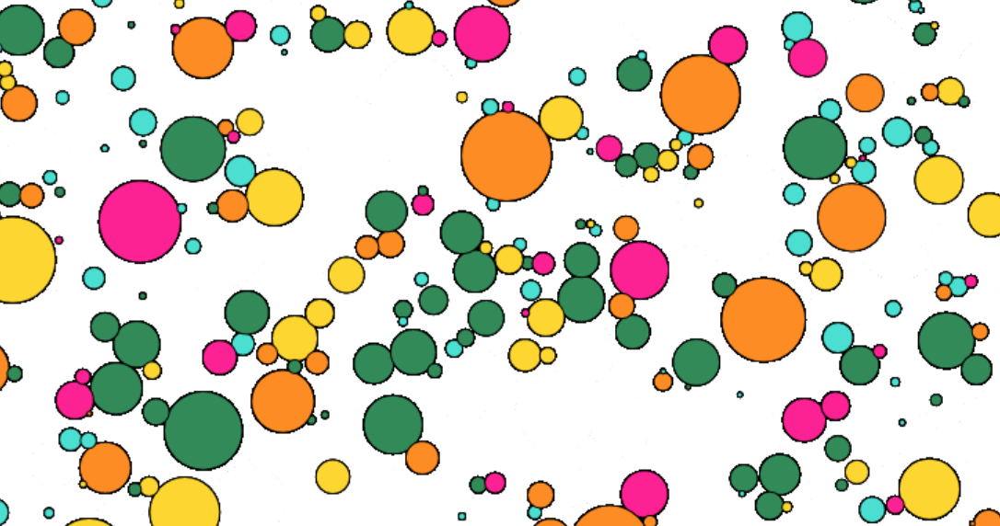

# reforestation

>A simulation of tree growth in a forest. [Click here to see it.](http://zebengberg.github.io/reforestation)

## Motivation

After a forest is destroyed, new trees begin to grow and compete for space. Initially, fast-growth trees dominate the landscape. These trees grow quickly but are not as hearty as their slower-growth counterparts. Slower-growth trees will take longer to establish a footprint in the forest, but they survive longer. Over time, we expect a forest to transform from the fast-growth trees that initially spring-up to the old-growth trees that dominate a mature forest.

## Simulation

[This simulation](https://zebengberg.github.io/reforestation) demonstrates several different species of trees growing in a forest. An individual tree is displayed as a colored disk. Different species are distinguished with different colors, and each has its own growth rate and expected lifespan. As in nature, these two quantities vary in opposition to one another: the faster a tree grows, the shorter its expected lifespan.

At each time step, this model is governed by the following rules.
- If available space exists, new trees are born in random positions with a randomly assigned species.
- Each tree that already exists in the forest grows in a stochastic manner dependent on the growth rate of its underlying species.
- No tree is allowed to grow into another existing tree; trees should not overlap. Trees cannot grow beyond a certain hardcoded maximal radius.
- Each tree has a small chance of dying dependent on its growth rate and its age. After a tree dies, it will be removed from the forest in order to open up space for new tree growth.

Forest-wide metrics are displayed in the upper left-hand corner of the html canvas. The total area of all trees of a given species is color-coded and displayed; these totals are sorted to give a ranking of the species and to give an overall summary of the forest.

Every tree displayed on the html canvas is an instance of class `Tree`. `Tree` properties include **(x, y)** coordinates, a radius, and a species type. The species type affects both the growth rate and the expected lifespan of the `Tree` object. `Tree` methods include `grow()`, `draw()`, `getDistance()`, and `getArea()`.

Global variables and functions hold forest-wide information, including various scaling parameters and containers holding the individual `Tree` objects. Notable functions include `setClosestNeighborDist()`, which calculates the distance between each tree and its nearest neighbor. Another useful method is `clearCut()`, which kills all trees within a disk centered at a mouse click generated by the user.

The user can input some information through a number of different sliders. The most interesting of these is a slider that determines the species-type of newly birthed seedlings.

## Algorithm

The most computationally-interesting aspect of this program is the calculation of each tree's nearest neighbor. Classically, problems involving neighbors in a network have been well-studied. In this particular project, we are tasked with an *all nearest neighbor*-style problem: for each tree, we must calculate the distance to the nearest neighbor. If there are **n** trees, the naive algorithm would compare each tree with every other tree to find its nearest neighbor. This procedure requires **O(n^2)** steps. There are more efficient general procedures such as [*Vaidya's algorithm*](https://link.springer.com/article/10.1007/BF02187718) which require only **O(n log(n))** steps.

In this project, we need to calculate nearest neighbor distances in order to prevent trees from overlapping. We also need to know information about neighbors in order to create new seedlings with a species-type dependent on neighboring parents.

For each tree, the maximal possible radius is constrained. This second property can be algorithmically exploited: If two trees are further apart than twice the maximal radius, then it will not be possible for these two trees to overlap after growing. This observation allows us to only calculate the distance between a given tree and those trees in the immediate vicinity.

The forest is initially partitioned into disjoint small boxes, each with an index **(u, v)**. Connected 3x3 swaths of these small boxes are merged to form overlapping big boxes, each of which is given the index of its central small box. A tree in the small box at **(u, v)** must only be compared with trees in the big box at **(u, v)**.

This algorithm now has a runtime of **O(n)**. Here the implied constant depends on the number of trees in each big box, which itself depends on the maximal radius. In particular, if the maximal radius is **R**, the runtime of this algorithm is **O(n R^2)**.

## Forest evolution

In progress. Will allow tree species to evolve their growth parameters over time through natural selection.

## License

This project is released under the [MIT license](https://opensource.org/licenses/MIT).
